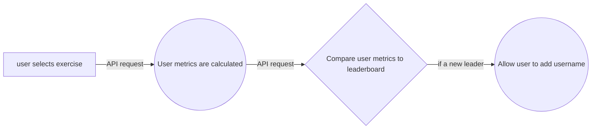

# Implementations

**Angular/front end**

- real time typing test
- rxjs observables
- connection to an API
- use of angular data methods for scalability
- ngx smooth scroll
- using flex box
- responsive design

**Node js/backend**

- creating api end points
- creating a custom node app for serving the api
- integrating with mongo db
- using mongoose
- custom controllers and data schemas

## Data Model

